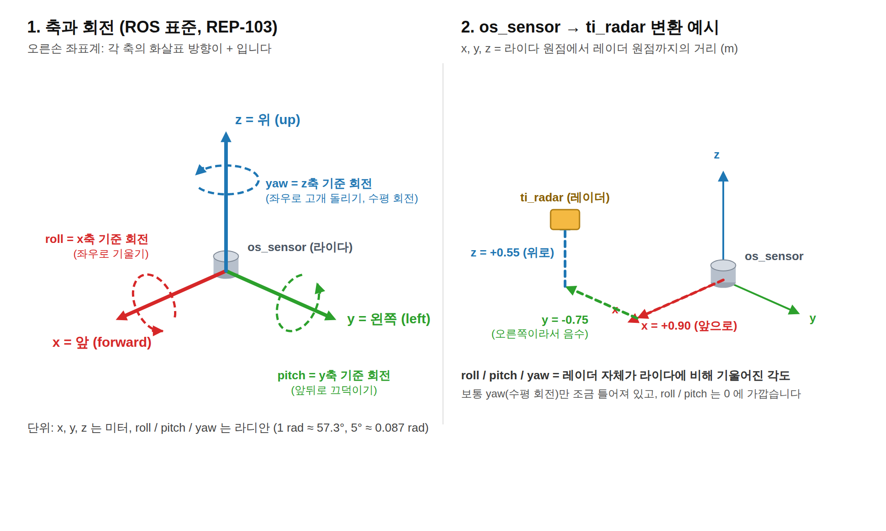

# radar_tf_tuner

RViz에서 레이더 포인트(`ti_radar`)와 라이다 포인트(`os_sensor`)를 겹쳐 보면서
두 프레임 사이의 TF를 실시간으로 조정하는 ROS 2 노드입니다.

`static_transform_publisher`는 값을 바꿀 때마다 재실행해야 하지만, 이 노드는
x, y, z, roll, pitch, yaw를 ROS 파라미터로 받아 **정적 TF**(`/tf_static`)로 내보내므로
`rqt_reconfigure` 슬라이더로 움직이면서 RViz에서 바로 결과를 볼 수 있습니다.
파라미터가 바뀔 때마다 정적 TF를 다시 보내면 tf2 버퍼의 기존 값이 덮어써집니다.

정적 TF를 쓰는 이유: `static_transform_publisher`와 똑같이 "모든 시간에 유효한"
변환으로 취급되기 때문입니다. 동적 TF(`/tf`)로 보내면 레이더 메시지의 타임스탬프가
0이거나 이 PC의 시계와 다를 때 "extrapolation" 에러로 RViz가 변환에 실패합니다.

## 배경: RViz에서 "Could not transform from [ti_radar] to [os_sensor]"

RadarPoints 디스플레이가 `Status: Error`이고 위 메시지가 나오면 TF 트리에
`ti_radar`와 `os_sensor`를 잇는 변환이 없는 것입니다. 진단은 다음과 같이 합니다.

```bash
ros2 topic echo <레이더 토픽> --field header.frame_id   # 실제 frame_id 확인
ros2 run tf2_tools view_frames                        # frames.pdf 로 TF 트리 확인
ros2 run tf2_ros tf2_echo os_sensor ti_radar          # 두 프레임 사이 변환 가능 여부
```

`tf2_echo`에서 "frame does not exist" 또는 "not connected"가 나오면 TF 연결이
없는 것이고, "extrapolation"이 나오면 타임스탬프(`use_sim_time`, 시간 동기화) 문제입니다.

## 요구 사항

- ROS 2 (Humble 이상 권장)
- `rqt_reconfigure` (`sudo apt install ros-$ROS_DISTRO-rqt-reconfigure`)

## 실행 방법

1. 기존에 띄워 둔 `static_transform_publisher`(os_sensor → ti_radar)는 종료합니다.
   같은 프레임을 두 곳에서 publish하면 충돌합니다.

2. 튜닝 노드를 실행합니다.

   ```bash
   python3 radar_tf_tuner.py
   ```

   노드는 로그에 `static_transform_publisher` 명령을 출력하지만 **그 명령을 실행하지는
   않습니다.** 노드 자신이 `/tf_static`으로 변환을 내보내고 있고, 로그는 나중에 launch
   파일에 옮겨 적기 위한 참고용입니다.

   프레임 이름이 다르면 파라미터로 넘깁니다.

   ```bash
   python3 radar_tf_tuner.py --ros-args -p parent_frame:=os_sensor -p child_frame:=ti_radar
   ```

3. 다른 터미널에서 슬라이더 UI를 띄웁니다.

   ```bash
   ros2 run rqt_reconfigure rqt_reconfigure
   ```

   왼쪽 목록에서 `radar_tf_tuner`를 선택하면 x, y, z, roll, pitch, yaw 슬라이더가
   나옵니다. `os_sensor` 기준으로 x는 앞뒤, y는 좌우, z는 위아래(m), yaw는 수평 회전(rad)입니다.
   슬라이더를 움직이면 RViz의 레이더 포인트가 바로 따라 움직입니다.

   GUI 없이 터미널에서 바꾸려면:

   ```bash
   ros2 param set /radar_tf_tuner y 0.15
   ros2 param set /radar_tf_tuner yaw 0.05
   ```

4. 값이 맞으면 저장합니다. 파라미터가 바뀔 때마다 노드 로그에 완성된
   `static_transform_publisher` 명령이 출력되므로 마지막 줄을 launch 파일이나
   URDF에 옮기면 됩니다. YAML로 남기려면:

   ```bash
   ros2 param dump /radar_tf_tuner > radar_tf.yaml
   ```

## x, y, z, roll, pitch, yaw 의 의미



ROS는 오른손 좌표계(REP-103)를 씁니다. 모든 값은 `parent_frame`(os_sensor, 라이다)
기준으로 `child_frame`(ti_radar, 레이더)가 어디에 어떻게 놓여 있는지를 나타냅니다.

| 값 | 의미 | + 방향 | 단위 |
|---|---|---|---|
| x | 라이다에서 레이더까지 앞뒤 거리 | 앞 | m |
| y | 좌우 거리 | 왼쪽 | m |
| z | 위아래 거리 | 위 | m |
| roll | x축(앞 방향)을 축으로 회전 | 왼쪽이 올라감 | rad |
| pitch | y축(왼쪽 방향)을 축으로 회전 | 앞이 내려감 | rad |
| yaw | z축(위 방향)을 축으로 회전 | 위에서 봤을 때 반시계 (왼쪽으로 돌기) | rad |

- 레이더가 라이다 오른쪽에 있으면 y는 음수, 아래에 있으면 z는 음수입니다.
- 각도는 라디안입니다. 5° ≈ 0.087 rad, 10° ≈ 0.175 rad, 1 rad ≈ 57.3°.

슬라이더로 조정할 때 증상별로 만질 값:

- 레이더 포인트가 통째로 앞뒤로 밀리면 x, 좌우로 밀리면 y, 위아래로 뜨면 z.
- 가까운 포인트는 맞는데 먼 포인트가 좌우로 벌어지면 yaw. 거리에 비례해 어긋나는 것이 회전 오차의 특징입니다.
- 먼 포인트가 위아래로 벌어지면 pitch, 좌우 끝이 서로 반대로 위아래로 틀어지면 roll.

## 문제 해결

**노드를 띄웠는데 RViz의 RadarPoints가 여전히 Error일 때**

1. 변환이 실제로 나가는지 확인합니다. 아래에 `os_sensor` → `ti_radar` 항목이 보여야 합니다.

   ```bash
   ros2 topic echo /tf_static --qos-durability transient_local --qos-reliability reliable
   ros2 run tf2_ros tf2_echo os_sensor ti_radar
   ```

2. 안 보이면 노드와 RViz가 서로를 못 보는 것입니다. `ros2 node list`에 `/radar_tf_tuner`가
   있는지, 두 터미널의 `ROS_DOMAIN_ID`가 같은지, WSL2라면 네트워크 모드가 mirrored인지 확인합니다.

3. 보이는데도 Error이면 프레임 이름 불일치입니다. 레이더 메시지의 실제 `header.frame_id`와
   RViz Fixed Frame을 확인하고, 다르면 `-p child_frame:=...`, `-p parent_frame:=...`으로 맞춥니다.

   ```bash
   ros2 topic echo <레이더 토픽> --field header.frame_id
   ```

4. RViz의 RadarPoints 디스플레이를 껐다 켜거나, 왼쪽 패널의 Reset을 눌러 TF 버퍼를 비웁니다.

## 매칭 팁

- RViz에서 레이더 포인트는 Size를 0.1 정도로 키우고 라이다와 다른 색으로 두면 겹침이 잘 보입니다.
- 벽 모서리, 코너 리플렉터, 기둥처럼 두 센서 모두에서 뚜렷한 물체를 기준으로 맞춥니다.
- 순서는 yaw → x, y → z, pitch 순이 빠릅니다. 레이더는 z 정밀도가 낮으므로 수평면 위주로 맞춰도 충분한 경우가 많습니다.
- ROS 1이라면 같은 구조를 `dynamic_reconfigure` + `rqt_reconfigure`로 만들면 됩니다.
